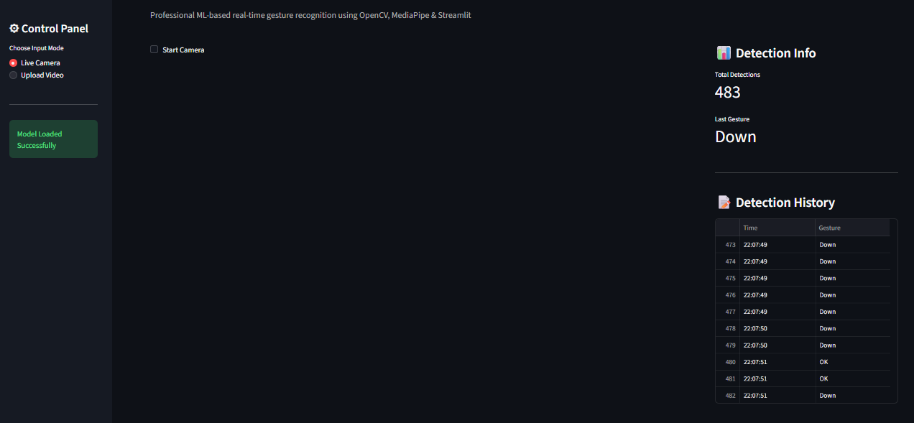
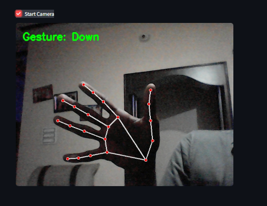
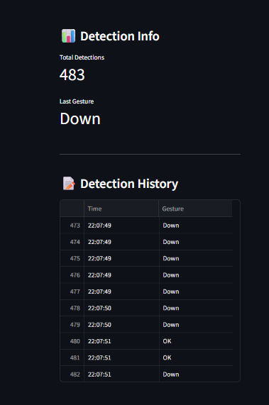

# 🖐 Hand Gesture Recognition System

A professional real-time Hand Gesture Recognition System developed using Machine Learning, OpenCV, MediaPipe, and Streamlit as part of the SkillCraft Technology Machine Learning Internship.

---

# 🚀 Features

- Real-time hand gesture recognition
- Live webcam detection
- Upload video support
- MediaPipe hand landmark tracking
- Detection history tracking
- Professional Streamlit UI
- Machine Learning gesture classification

---

# 🛠 Technologies Used

- Python
- OpenCV
- MediaPipe
- Streamlit
- Scikit-learn
- NumPy
- Pandas

---

---

# 📸 Project Screenshots

## 🏠 Main Interface



---

## ✋ Live Hand Detection



---

## 📹 Video Upload Detection



---

# ▶ How to Run the Project

## Step 1 — Clone Repository

```bash
git clone https://github.com/Saikishorep15/SCT_ML_4.git
```

---

## Step 2 — Install Dependencies

```bash
pip install -r requirements.txt
```

---

## Step 3 — Run Streamlit App

```bash
python -m streamlit run app.py
```

---

# 📊 Model Details

- Algorithm: Random Forest Classifier
- Dataset: LeapGestRecog
- Accuracy Achieved: 100%

---

# 🌟 Future Improvements

- Sign language recognition
- Gesture-based virtual mouse
- Voice assistant integration
- Advanced deep learning models

---

# 📂 Project Structure

```bash
SCT_ML_4/
│
├── dataset/
├── images/
│   ├── image1.png
│   ├── image2.png
│   └── image3.png
│
├── app.py
├── train_model.py
├── gesture_model.pkl
├── README.md
└── requirements.txt

# 👨‍💻 Author

**SaiKishore P**

SkillCraft Technology Machine Learning Internship

---

# 🔗 GitHub Repository

https://github.com/Saikishorep15/SCT_ML_4

---

# 📌 Internship Task

Task 4 — Develop a hand gesture recognition model that can accurately identify and classify different hand gestures from image or video data.
